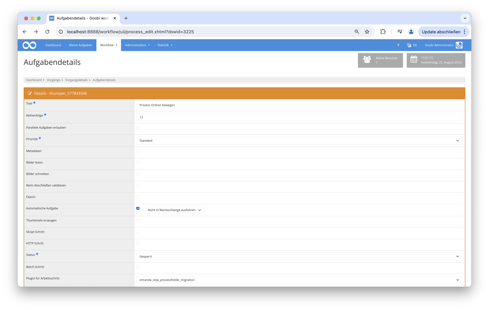

## Einführung
Diese Dokumentation erläutert, wie dieses Plugin dafür genutzt werden kann Datei- oder Verzeichnisoperationen auszuführen.

## Installation
Um das Plugin nutzen zu können, müssen folgende Dateien installiert werden:

```bash
/opt/digiverso/goobi/plugins/step/plugin_intranda_step_processfolder_migration.jar
/opt/digiverso/goobi/config/plugin_intranda_step_processfolder_migration.xml
```

Nach der Installation des Plugins kann dieses innerhalb des Workflows für die jeweiligen Arbeitsschritte ausgewählt und somit automatisch ausgeführt werden.




## Überblick und Funktionsweise
Dieses Plugin führt automatisierte Datei- und Verzeichnismanipulationen durch. Dabei lassen sich in der Konfigurationsdatei verschiedene Regeln definieren, die festlegen, welche Aktionen auf welche Dateien oder Verzeichnisse angewendet werden sollen.

## Konfiguration
Die Konfiguration des Plugins erfolgt in der Datei `plugin_intranda_step_processfolder_migration.xml` wie hier aufgezeigt:

{{CONFIG_CONTENT}}

{{CONFIG_DESCRIPTION_PROJECT_STEP}}

Parameter               | Erläuterung
------------------------|------------------------------------
`action`                | Dies ist der Parameter, der bestimmt, welche Aktion auf dem angegebenen Verzeichnis oder der Datei ausgeführt wird. Die möglichen Werte sind: `delete`, `create`, `move` oder `copy` .|
`delete`                | Diese Aktion löscht einen Ordner oder ein Verzeichnis. |
`create`                | Diese Aktion erstellt einen neuen Ordner oder ein Verzeichnis. |
`move`                  | Diese Aktion bewegt einen Ordner oder ein Verzeichnis vom aktuellen Ort, zum Zielort. |
`copy`                  | Diese Aktion kopiert einen Ordner oder ein Verzeichnis und fügt es am Zielort ein. |
`source`                | Das ist der Ordner oder das Verzeichnis, von welchem aus eine Aktion ausgeführt werden soll, zum Beispiel das Kopieren von einer Datei aus diesem Ordner.|
`target`                | Das ist der Ordner oder das Verzeichnis, zu welchem eine Aktion ausgeführt werden soll zum Beispiel das Kopieren einer Datei in diesen Ordner.|
