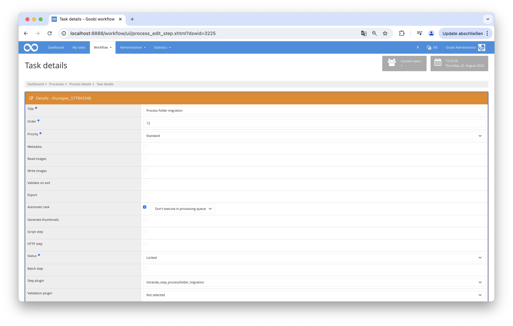

## Introduction
This documentation explains how this plugin can be used to perform file or directory operations.

## Installation
To be able to use the plugin, the following files must be installed:

```bash
/opt/digiverso/goobi/plugins/step/plugin_intranda_step_processfolder_migration.jar
/opt/digiverso/goobi/config/plugin_intranda_step_processfolder_migration.xml
```

After the plugin is installed, it can be selected within the workflow for the respective tasks and thus executed automatically.




## Overview and functionality
This plugin performs automated file and directory manipulations. Various rules can be defined in the configuration file to specify which actions should be applied to which files or directories.


## Configuration
The plugin is configured in the file `plugin_intranda_step_processfolder_migration.xml` as shown here:

{{CONFIG_CONTENT}}

{{CONFIG_DESCRIPTION_PROJECT_STEP}}

| Parameter | Explanation |
|------------------------|------------------------------------|
| `action`                | This is the parameter that determines which action will be performed on the specified directory or file. The possible values are: `delete`, `create`, `move`, or `copy`. |
| `delete`                | This action deletes a folder or directory. |
| `create`                | This action creates a new folder or directory. |
| `move`                  | This action moves a folder or directory from the current location to the destination location. |
| `copy`                  | This action copies a folder or directory and inserts it at the destination location. |
| `source`                | This is the folder or directory from which an action should be performed, for example, copying a file from this folder. |
| `target`                | This parameter defines the directory to which an action should be performed (for example, copying a file to this folder). |
